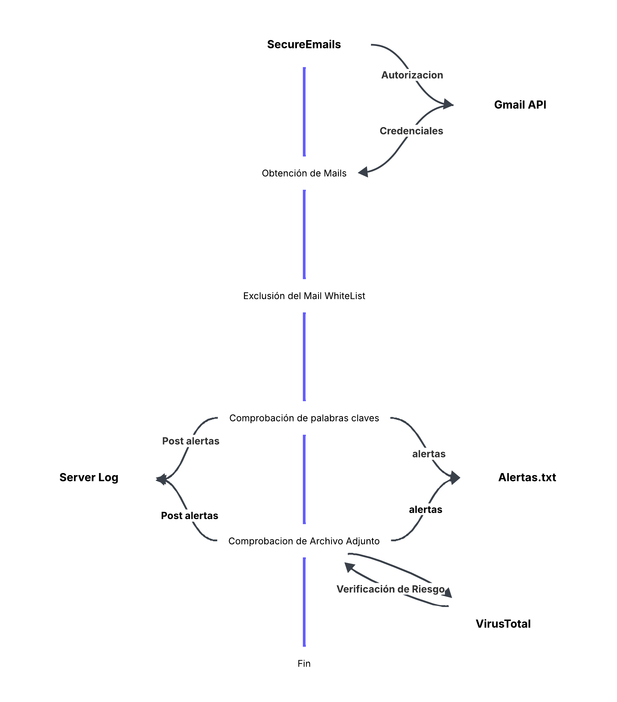

# API GMAIL (challenge-02)

Permite revisar correos electrónicos en busqueda de actividad sensible y sospechosa, detectando la palabra contraseña o confidencial. Marcando la actividad en un archivo, imprimiendo en consonsola y enviando mediante un post a un servidor en flask

---

## 🔧 Requisitos & Aclaración

- Python 3.11 o superior
- pip actualizado

```bash
SecureEmails_explained_code es el codigo con todo explicado de su funcionamiento en caso de ser necesario para su entendimiento y depuración.
```

---

## 📦 Instalación

1. Actualizar `pip` (opcional pero recomendado):

```bash
pip install --upgrade pip
pip install py3
pip install --upgrade google-auth-oauthlib requests-oauthlib
pip install flask
pip install filetype
```
---
## 🚀 Ejecución

1. (Opcional) Levantar el servidor Flask para recibir los logs

```bash
py Server.py
```

2. Ejecutar el script de revisión de correos

```bash
py SecureEmails.py
```

| Argumento  | Tipo | Descripción                                | Valor por defecto    |
| ---------- | ---- | ------------------------------------------ | -------------------- |
| `--revise` | int  | Cantidad de correos electrónicos a revisar | `5`                  |
| `--url`    | str  | URL del servidor para enviar la alerta     | `"http://127.0.0.1"` |
| `--port`   | str  | Puerto del servidor para enviar la alerta  | `"5555"`             |
| `--virustotal`| NaN  | Activa la verificación del archivo contra VirusTotal  | `False`             |

Ejemplo por defecto
```bash
py SecureEmails.py --revise 5 --url http://127.0.0.1 --port 5555 --virustotal
```

## Mapa del Flujo

